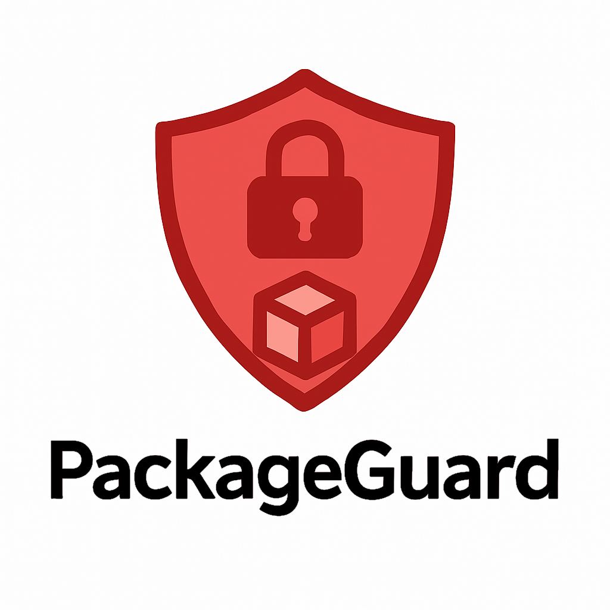
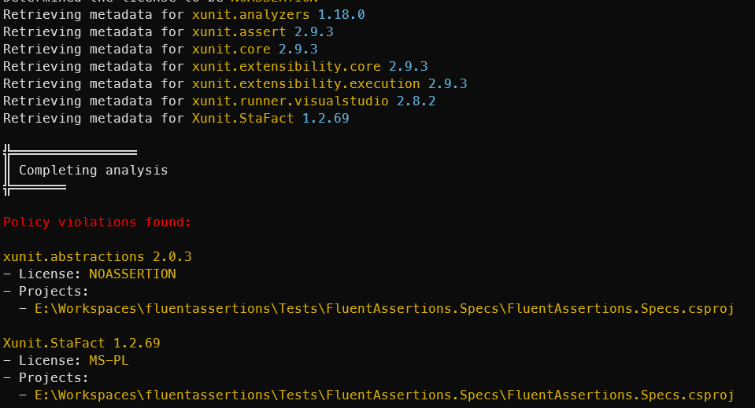

<div align="center">
  
</div>
<h1 align="center">Get a grip on your open-source packages</h4>

<div align="center">

[](https://github.com/dennisdoomen/packageguard/actions?query=branch%3amain)
[](https://coveralls.io/github/dennisdoomen/packageguard?branch=main)
[](https://github.com/dennisdoomen/packageguard/releases/latest)
[](https://www.nuget.org/packages/packageguard)
[](https://libraries.io/nuget/packageguard)

[](https://github.com/dennisdoomen/packageguard/graphs/contributors)
[](https://github.com/dennisdoomen/packageguard)
[](https://github.com/dennisdoomen/packageguard/graphs/commit-activity)
[](https://github.com/dennisdoomen/packageguard/issues)
[](https://makeapullrequest.com)


<a href="#about">About</a> •
<a href="#download">Download</a> •
<a href="#how-do-i-configure-it">How To Configure</a> •
<a href="#how-do-i-use-it">How To Use</a> •
<a href="#roadmap">Roadmap</a> •
<a href="#building">Building</a> •
<a href="#contributing">Contributing</a> •
<a href="#versioning">Versioning</a> •
<a href="#credits">Credits</a> •

</div>

## About

### What's this?

PackageGuard is a fully open-source tool to scan the NuGet dependencies of your .NET solutions against a deny- or allowlist to control the open-source licenses that you want to allow or certain versions of certain packages you want to enforce or avoid. 

### What's so special about that?

I've noticed that the commercial solutions for this are usually very expensive and have functionality that smaller companies may not need. Hopefully this little tools fills the gap between tools like GitHub's Dependabot and expensive commercial products like Blackduck, SNYK  and others.

### Who created this?
My name is Dennis Doomen and I'm a Microsoft MVP and Principal Consultant at [Aviva Solutions](https://avivasolutions.nl/) with 28 years of experience under my belt. As a software architect and/or lead developer, I specialize in designing full-stack enterprise solutions based on .NET as well as providing coaching on all aspects of designing, building, deploying and maintaining software systems. I'm the author of several open-source projects such as [Fluent Assertions](https://www.fluentassertions.com), [Reflectify](https://github.com/dennisdoomen/reflectify), [Liquid Projections](https://www.liquidprojections.net), and I've been maintaining [coding guidelines for C#](https://www.csharpcodingguidelines.com) since 2001.

Contact me through [Email](mailto:dennis.doomen@avivasolutions.nl), [Bluesky](https://bsky.app/profile/dennisdoomen.com), [Twitter/X](https://twitter.com/ddoomen) or [Mastadon](https://mastodon.social/@ddoomen)

## Download

The tool is available in two forms:

### As a .NET Global Tool (recommended)

Install as [a NuGet Tool package](https://www.nuget.org/packages/packageguard):

  `dotnet tool install PackageGuard --global`

Then use `packageguard --help` to see a list of options.

### As a standalone executable (Windows only)

Download the latest `PackageGuard-{version}-win-x64.zip` from the [releases page](https://github.com/dennisdoomen/packageguard/releases/latest), extract it, and run `PackageGuard.exe` directly. This is a self-contained Windows executable that does not require .NET to be installed.

```
USAGE:
    packageguard [path] [OPTIONS]         # When installed as a global tool
    PackageGuard.exe [path] [OPTIONS]     # When using the standalone executable

ARGUMENTS:
    [path]    The path to a directory containing a .sln/.slnx file, a specific .sln/.slnx file, or a specific .csproj file. Defaults to the current working
              directory

OPTIONS:
    -h, --help                   Prints help information
    -c, --config-path            The path to the configuration file. Defaults to the config.json in the current working directory
    -i, --restore-interactive    Allow enabling or disabling an interactive mode of "dotnet restore". Defaults to true
    -f, --force-restore          Force restoring the NuGet dependencies, even if the lockfile is up-to-date
    -s, --skip-restore           Prevent the restore operation from running, even if the lock file is missing or out-of-date
    -a, --github-api-key         GitHub API key to use for fetching package licenses. If not specified, you may run into GitHub's rate limiting issues
        --use-caching            Maintains a cache of the package information to speed up future analysis
        --cache-file-path        Overrides the file path where analysis data is cached. Defaults to the "<workingdirectory>/.packageguard/cache.bin"
```

## How do I configure it?

PackageGuard supports hierarchical configuration files that are automatically discovered based on your solution and project structure. This allows you to define organization-wide policies at the solution level and add project-specific rules as needed.

### Hierarchical Configuration Discovery

PackageGuard will automatically look for configuration files in the following order:

1. **Solution level**: `packageguard.config.json` in the same folder as your `.sln` or `.slnx` file
2. **Solution level**: `config.json` in a `.packageguard` subdirectory of your solution folder  
3. **Project level**: `packageguard.config.json` in individual project directories
4. **Project level**: `config.json` in a `.packageguard` subdirectory of project directories

Settings from multiple configuration files are merged together, with project-level settings taking precedence over solution-level settings for boolean values, while arrays (packages, licenses, feeds) are combined.

### Manual Configuration Path

You can still specify a custom configuration file path using the `--configpath` CLI parameter to override the hierarchical discovery:

```bash
packageguard --configpath path/to/my-config.json
```

### Configuration Format

Each configuration file should follow this JSON format:

```json
{
    "settings": {
        "allow": {
          "prerelease": false,
          "licenses": [
              "Apache-2.0", // Uses SPDX naming
              "MIT",
          ],
          "packages": [
              "MyPackage/[7.0.0,8.0.0)"
          ],
          "feeds": [
            "*dev.azure.com*"
          ]
        },
        "deny": {
          "licenses": [],
          "packages": [
            "ProhibitedPackage"
          ]
        },
        "ignoredFeeds": [
          "https://pkgs.dev.azure.com/somecompany/project/_packaging/myfeed/nuget/v3/index.json"
        ]
    }
}
```

In this example, only NuGet packages with the MIT or Apache 2.0 licenses are allowed, the use of the package `ProhibitedPackage` and any pre-release packages (e.g. `0.1.2` or `1.0.2-beta.2`) are prohibited, and `MyPackage` should stick to version 7 only. Both the `allow` and `deny` sections support the `licenses` and `packages` properties. But licenses and packages listed under `allow` have precedence over those under the `deny` section.

> [!IMPORTANT]
> Deny rules always take precedence over allow rules. If a package is denied by the `deny` section, it will be blocked regardless of what the `allow` section specifies.

### Example: Multi-level Configuration

**Solution-level configuration** (`MySolution/packageguard.config.json`):
```json
{
    "settings": {
        "allow": {
            "licenses": ["MIT", "Apache-2.0"],
            "packages": ["Microsoft.*", "System.*"]
        },
        "deny": {
            "packages": ["UnsafePackage"]
        }
    }
}
```

**Project-level configuration** (`MySolution/WebProject/packageguard.config.json`):
```json
{
    "settings": {
        "allow": {
            "licenses": ["BSD-3-Clause"],
            "packages": ["WebSpecificPackage/[1.0.0,2.0.0)"]
        }
    }
}
```

The effective configuration for `WebProject` will allow:
- Licenses: MIT, Apache-2.0, BSD-3-Clause (merged)
- Packages: Microsoft.*, System.*, WebSpecificPackage/[1.0.0,2.0.0) (merged)
- Denied packages: UnsafePackage (inherited)

### Identifying packages and license

License names are case-insensitive and follow the [SPDX identifier](https://spdx.org/licenses/) naming conventions, but we have special support for certain proprietary Microsoft licenses such as used by the `Microsoft.AspNet.WebApi*` packages. For those, we support using the license name `Microsoft .NET Library License`.

Package names can include just the NuGet ID but may also include a [NuGet-compatible version (range)](https://learn.microsoft.com/en-us/nuget/concepts/package-versioning?tabs=semver20sort) separated by `/`. Here's a summary of the possible notations:


| Notation        | Valid versions     |
|-----------------|--------------------|
| "Package/1.0"   | 1.0            |
| "Package/[1.0,)"| v ≥ 1.0            |
| "Package/(1.0,)"          | v > 1.0            |
| "Package/[1.0]"           | v == 1.0           |
| "Package/(,1.0]"          | v ≤ 1.0            |
| "Package/(,1.0)"          | v < 1.0            |
| "Package/[1.0,2.0]"       | 1.0 ≤ v ≤ 2.0      |
| "Package/(1.0,2.0)"       | 1.0 < v < 2.0      |
| "Package/[1.0,2.0)"       | 1.0 ≤ v < 2.0      |

### About feeds

PackageGuard follows the same logic for getting the applicable NuGet feeds as `dotnet` or your IDE does. That also means that it will use the configured credential providers to access authenticated feeds. 

You can tell PackageGuard to allow all packages from a particular feed, even if a package on that feed doesn't meet the licenses or packages listed under `allow`. Just add the element `feeds` under the `allow` element and specify a wildcard pattern that matches the name or URL of the feed.

```json
{
    "settings": {
        "allow": {
            "feeds": ["*dev.azure.com*"]
        }
    }
}
```

And in case you want to prevent PackageGuard from trying to access a particular feed altogether, add them to the `ignoredFeeds` element. Notice that PackageGuard may still trigger a `dotnet restore` call if the package lock file (`project.assets.json`) doesn't exist yet, unless you use the `SkipRestore` option, that will use all available NuGet feeds.

## How do I use it?

With this configuration in place, simply invoke PackageGuard like this

`packageguard --configpath <path-to-config-file> <path-to-solution-file-or-project>`

If you pass a directory, PackageGuard will try to find the `.sln` or `.slnx` files there. But you can also specify a specific `.csproj` to scan. 

If everything was configured correctly, you'll get something like:



The exit code indicates either 0 for success or 1 for failure. 

## Additional notes

### Speeding up the analysis using caching

One of the most expensive operations that PackageGuard needs to do is to download find the license information from GitHub or other sources. You can significantly speed-up the analysis process by using the `--use-caching` flag. 

By default, this will cause PackageGuard to persist the license information it retrieved to a binary file under `.packageguard\cache.bin`. You can commit this file to source control so successive runs can reuse the license information it collected during a previous run. 

If PackageGuard finds new packages in your project or solution that did not exist during the previous run, then it will update the cache after the analysis is completed.  

### Github rate limiting issues

If you're running into errors from GitHub like 

  `Response status code does not indicate success: 403 (rate limit exceeded).`

it means PackageGuard has ran into the [rate limits](https://docs.github.com/en/rest/using-the-rest-api/rate-limits-for-the-rest-api?apiVersion=2022-11-28) of `api.github.com` while trying to fetch license information from certain repositories. You can solve that by either waiting an hour or creating a GitHub Personal Access Token with the `public_repo` scope. You can find more information about those tokens [here](https://docs.github.com/en/apps/oauth-apps/building-oauth-apps/scopes-for-oauth-apps).

After having generated such a token, pass it to PackageGuard through its `github-api-key` option or set-up an environment variable named `GITHUB_API_KEY`.

## Roadmap

This is a rough list of items from my personal backlog that I'll be working on the coming weeks.

**Major features**
- Add NPM support

**Minor features**
- Allow specifying the location of `dotnet.exe`
- Allow ignoring certain .csproj files or folders using Globs or wildcards (e.g. build.csproj)
- Allow marking all violations as a warning
- Allow marking individual violations as a warning
- Expose the internal engine through the `PackageGuard.Core` NuGet package
- Add direct support for [Nuke](https://nuke.build/)
- Allow loading settings from the directory of the scanned project and move up if not found
- Display the reason why a package was marked as a violation

## Building

To build this repository locally, you need the following:
* The [.NET SDK](https://dotnet.microsoft.com/en-us/download/visual-studio-sdks) for .NET 8.0.
* Visual Studio, [JetBrains Rider](https://www.jetbrains.com/rider/) or [Visual Studio Code](https://code.visualstudio.com/) with the [C# DevKit](https://marketplace.visualstudio.com/items?itemName=ms-dotnettools.csdevkit)

You can also build, run the unit tests and package the code using the following command-line:

`build.ps1`

Or, if you have, the [Nuke tool installed](https://nuke.build/docs/getting-started/installation/):

`nuke`

Also try using `--help` to see all the available options or `--plan` to see what the scripts does.

## Contributing

Your contributions are always welcome! Please have a look at the [contribution guidelines](CONTRIBUTING.md) first.

Previous contributors include:

<a href="https://github.com/dennisdoomen/packageguard/graphs/contributors">
  
</a>

(Made with [contrib.rocks](https://contrib.rocks))

## Versioning
This library uses [Semantic Versioning](https://semver.org/) to give meaning to the version numbers. For the versions available, see the [tags](/releases) on this repository.

## Credits
This library wouldn't have been possible without the following tools, packages and companies:

* [Spectre.Console](https://spectreconsole.net/) - a .NET library that makes it easier to create beautiful console applications.
* [Nuke](https://nuke.build/) - Smart automation for DevOps teams and CI/CD pipelines by [Matthias Koch](https://github.com/matkoch)
* [CliWrap](https://github.com/Tyrrrz/CliWrap) - Library for running command-line processes by [Oleksii Holub](https://github.com/Tyrrrz)
* [Coverlet](https://github.com/coverlet-coverage/coverlet) - Cross platform code coverage for .NET by [Toni Solarin-Sodara](https://github.com/tonerdo)
* [GitVersion](https://gitversion.net/) - From git log to SemVer in no time
* [ReportGenerator](https://reportgenerator.io/) - Converts coverage reports by [Daniel Palme](https://github.com/danielpalme)
* [StyleCopyAnalyzer](https://github.com/DotNetAnalyzers/StyleCopAnalyzers) - StyleCop rules for .NET
* [Roslynator](https://github.com/dotnet/roslynator) - A set of code analysis tools for C# by [Josef Pihrt](https://github.com/josefpihrt)
* [Serilog](https://serilog.net/) - Flexible, structured events — log file convenience
* [CSharpCodingGuidelines](https://github.com/bkoelman/CSharpGuidelinesAnalyzer) - Roslyn analyzers by [Bart Koelman](https://github.com/bkoelman) to go with the [C# Coding Guidelines](https://csharpcodingguidelines.com/)
* [Meziantou](https://github.com/meziantou/Meziantou.Framework) - Another set of awesome Roslyn analyzers by [Gérald Barré](https://github.com/meziantou)
* [FluentAssertions](https://github.com/fluentassertions/fluentassertions) - Extension methods to fluently assert the outcome of .NET tests
* [Verify](https://github.com/VerifyTests/Verify) - Snapshot testing by [Simon Cropp](https://github.com/SimonCropp)
* [Pathy](https://github.com/dennisdoomen/pathy?tab=readme-ov-file#readme) - Fluently building and using file and directory paths without binary dependencies
* [MemoryPack](https://github.com/Cysharp/MemoryPack) - Zero encoding extreme performance binary serializer for C# and Unity by [Yoshifumi Kawai](https://github.com/neuecc)

## Support the project
* [Sponsor me](https://github.com/sponsors/dennisdoomen)
* [Tip Me](https://paypal.me/fluentassertions)
* [Buy me a Coffee](https://ko-fi.com/dennisdoomen)

## You may also like

* [My Blog](https://www.dennisdoomen.com)
* [Reflectify](https://github.com/dennisdoomen/reflectify) - Reflection extensions without causing dependency pains
* [.NET Library Starter Kit](https://github.com/dennisdoomen/dotnet-package-templates) - A battle-tested starter kit for building open-source and internal NuGet libraries using "dotnet new", born from half a billion downloads
* [C# Coding Guidelines](https://csharpcodingguidelines.com/) - Forkable coding guidelines for all C# versions

## License
This project is licensed under the MIT License - see the [LICENSE](LICENSE) file for details.
