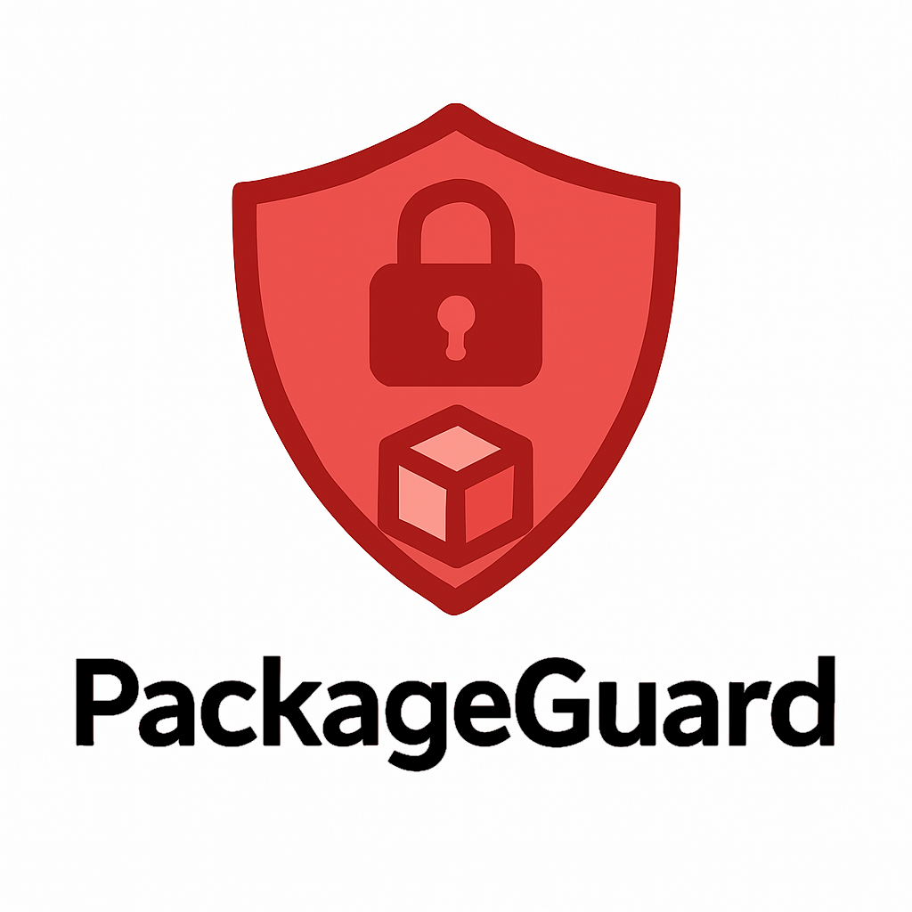
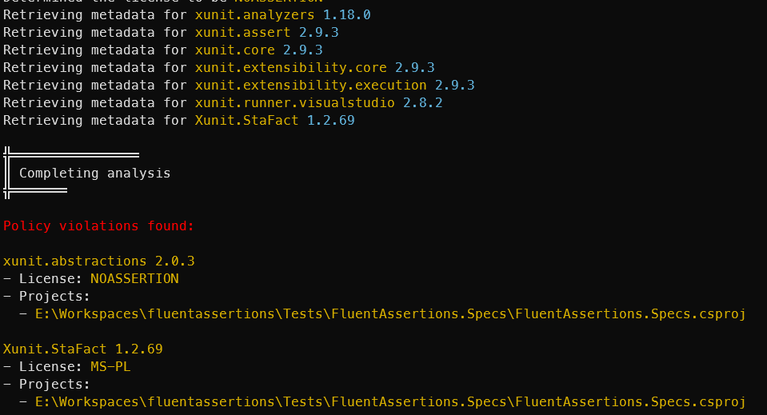

<div align="center">
  
</div>
<h1 align="center">Get a grip on your open-source packages</h4>

<div align="center">

[](https://github.com/dennisdoomen/packageguard/actions?query=branch%3amain)
[](https://coveralls.io/github/dennisdoomen/packageguard?branch=main)
[](https://github.com/dennisdoomen/packageguard/releases/latest)
[](https://www.nuget.org/packages/packageguard)
[](https://libraries.io/nuget/packageguard)

[](https://github.com/dennisdoomen/packageguard/graphs/contributors)
[](https://github.com/dennisdoomen/packageguard)
[](https://github.com/dennisdoomen/packageguard/graphs/commit-activity)
[](https://github.com/dennisdoomen/packageguard/issues)
[](https://makeapullrequest.com)


<a href="#about">About</a> •
<a href="#download">Download</a> •
<a href="#how-do-i-configure-it">How To Configure</a> •
<a href="#how-do-i-use-it">How To Use</a> •
<a href="#roadmap">Roadmap</a> •
<a href="#building">Building</a> •
<a href="#contributing">Contributing</a> •
<a href="#versioning">Versioning</a> •
<a href="#credits">Credits</a> •

</div>

## About

### What's this?

PackageGuard is a fully open-source tool to scan the NuGet, NPM, PNPM and Yarn dependencies of your codebase against a deny- or allowlist so to control the open-source licenses that you want to allow or certain versions of certain packages you want to enforce or avoid. 

### What's so special about that?

I've noticed that the commercial solutions for this are usually very expensive and have functionality that smaller companies may not need. Hopefully this little tools fills the gap between tools like GitHub's Dependabot and expensive commercial products like Blackduck, SNYK  and others.

### Who created this?
My name is Dennis Doomen and I'm a Microsoft MVP and Principal Consultant at [Aviva Solutions](https://avivasolutions.nl/) with 28 years of experience under my belt. As a software architect and/or lead developer, I specialize in designing full-stack enterprise solutions based on .NET as well as providing coaching on all aspects of designing, building, deploying and maintaining software systems. I'm the author of several open-source projects such as [Fluent Assertions](https://www.fluentassertions.com), [Reflectify](https://github.com/dennisdoomen/reflectify), [Liquid Projections](https://www.liquidprojections.net), and I've been maintaining [coding guidelines for C#](https://www.csharpcodingguidelines.com) since 2001.

Contact me through [Email](mailto:dennis.doomen@avivasolutions.nl), [Bluesky](https://bsky.app/profile/dennisdoomen.com), [Twitter/X](https://twitter.com/ddoomen) or [Mastadon](https://mastodon.social/@ddoomen)

## Download

The tool is available in two forms:

### As a .NET Global Tool (recommended)

Install as [a NuGet Tool package](https://www.nuget.org/packages/packageguard):

  `dotnet tool install PackageGuard --global`

Then use `packageguard --help` to see a list of options.

### As a portable deployment

Download the latest `PackageGuard-{version}.zip` from the [releases page](https://github.com/dennisdoomen/packageguard/releases/latest), extract it, and run it using `dotnet PackageGuard.dll`. This requires .NET 9.0 or later to be installed but works on Windows, Linux, and macOS.

```
USAGE:
    PackageGuard [path] [OPTIONS]            # When installed as a global tool
    dotnet PackageGuard.dll [path] [OPTIONS] # When using the portable deployment

ARGUMENTS:
    [path]    The path to a directory containing a .sln/.slnx file and/or a package.json, a specific .sln/.slnx file, a
              specific .csproj file, or a specific package.json. Defaults to the current working directory

OPTIONS:
                                 DEFAULT
    -h, --help                              Prints help information
    -c, --config-path                       The path to the configuration file. Defaults to hierarchical discovery of
                                            packageguard.config.json or .packageguard/config.json files starting from
                                            the solution directory
    -i, --restore-interactive    True       Allow enabling or disabling an interactive mode of "dotnet restore".
                                            Defaults to true
        --ignore-violations                 Don't fail the analysis if any violations are found. Defaults to false
    -f, --force-restore                     Force restoring the NuGet dependencies, even if the lockfile is up-to-date
    -s, --skip-restore                      Prevent the restore operation from running, even if the lock file is missing
                                            or out-of-date
    -a, --github-api-key                    GitHub API key to use for fetching package licenses. If not specified, you
                                            may run into GitHub's rate limiting issues
        --use-caching                       Maintains a cache of the package information to speed up future analysis
        --cache-file-path        False      Overrides the file path where analysis data is cached. Defaults to the
                                            "<workingdirectory>/.packageguard/cache.bin"
        --nuget                  True       Explicitly enable or disable scanning for .csproj, .sln or .slnx files
        --npm                               Explicitly specify the package manager to use (npm, yarn, pnpm). If not
                                            specified, it will detect it automatically
        --npm-exe-path                      The path to the npm, yarn or pnpm executable. If not specified, the system
                                            PATH is used
```

## How do I configure it?

PackageGuard supports hierarchical configuration files that are automatically discovered based on your .NET solution and project structure. This allows you to define repository-wide policies at the solution level and add project-specific rules as needed. Since PackageGuard will scan a single `package.json` per run, it will use the configuration that is associated with that directy.  

### Hierarchical Configuration Discovery

PackageGuard will automatically look for configuration files in the following order:

1. **Solution level**: `packageguard.config.json` in the same folder as your `.sln`, `.slnx` or `package.json` file 
2. **Solution level**: `config.json` in a `.packageguard` subdirectory of your solution or `package.json` folder  
3. **Project level**: `packageguard.config.json` in individual project directories
4. **Project level**: `config.json` in a `.packageguard` subdirectory of project directories

Settings from multiple configuration files are merged together, with project-level settings taking precedence over solution-level settings for boolean values, while arrays (packages, licenses, feeds) are combined.

### Manual Configuration Path

You can still specify a custom configuration file path using the `--configpath` CLI parameter to override the hierarchical discovery:

```bash
packageguard --configpath path/to/my-config.json
```

### Configuration Format

Each configuration file should follow this JSON format:

```json
{
    "settings": {
        "allow": {
          "prerelease": false,
          "licenses": [
              "Apache-2.0", // Uses SPDX naming
              "MIT",
          ],
          "packages": [
              "MyPackage/[7.0.0,8.0.0)"
          ],
          "feeds": [
            "*dev.azure.com*"
          ]
        },
        "deny": {
          "licenses": [],
          "packages": [
            "ProhibitedPackage"
          ]
        },
        "ignoredFeeds": [
          "https://pkgs.dev.azure.com/somecompany/project/_packaging/myfeed/nuget/v3/index.json"
        ]
    }
}
```

In this example, only NuGet and NPM packages with the MIT or Apache 2.0 licenses are allowed, the use of the package `ProhibitedPackage` and any pre-release packages (e.g. `0.1.2` or `1.0.2-beta.2`) are prohibited, and `MyPackage` should stick to version 7 only. Both the `allow` and `deny` sections support the `licenses` and `packages` properties. But licenses and packages listed under `allow` have precedence over those under the `deny` section.

> [!IMPORTANT]
> Deny rules always take precedence over allow rules. If a package is denied by the `deny` section, it will be blocked regardless of what the `allow` section specifies.

### Example: Multi-level Configuration

**Solution-level configuration** (`MySolution/packageguard.config.json`):
```json
{
    "settings": {
        "allow": {
            "licenses": ["MIT", "Apache-2.0"],
            "packages": ["Microsoft.*", "System.*"]
        },
        "deny": {
            "packages": ["UnsafePackage"]
        }
    }
}
```

**Project-level configuration** (`MySolution/WebProject/packageguard.config.json`):
```json
{
    "settings": {
        "allow": {
            "licenses": ["BSD-3-Clause"],
            "packages": ["WebSpecificPackage/[1.0.0,2.0.0)"]
        }
    }
}
```

The effective configuration for `WebProject` will allow:
- Licenses: MIT, Apache-2.0, BSD-3-Clause (merged)
- Packages: Microsoft.*, System.*, WebSpecificPackage/[1.0.0,2.0.0) (merged)
- Denied packages: UnsafePackage (inherited)

### Identifying packages and license

License names are case-insensitive and follow the [SPDX identifier](https://spdx.org/licenses/) naming conventions, but we have special support for certain proprietary Microsoft licenses such as used by the `Microsoft.AspNet.WebApi*` packages. For those, we support using the license name `Microsoft .NET Library License`.

Package names can include just the NuGet or NPM ID but may also include a [NuGet-compatible version (range)](https://learn.microsoft.com/en-us/nuget/concepts/package-versioning?tabs=semver20sort) separated by `/`. Here's a summary of the possible notations:


| Notation        | Valid versions     |
|-----------------|--------------------|
| "Package/1.0"   | 1.0            |
| "Package/[1.0,)"| v ≥ 1.0            |
| "Package/(1.0,)"          | v > 1.0            |
| "Package/[1.0]"           | v == 1.0           |
| "Package/(,1.0]"          | v ≤ 1.0            |
| "Package/(,1.0)"          | v < 1.0            |
| "Package/[1.0,2.0]"       | 1.0 ≤ v ≤ 2.0      |
| "Package/(1.0,2.0)"       | 1.0 < v < 2.0      |
| "Package/[1.0,2.0)"       | 1.0 ≤ v < 2.0      |

### About feeds

PackageGuard follows the same logic for getting the applicable NuGet or NPM feeds as `dotnet`, NPM package managers or your IDE does. That also means that it will use the configured credential providers to access authenticated and private feeds. 

You can tell PackageGuard to allow all packages from a particular feed, even if a package on that feed doesn't meet the licenses or packages listed under `allow`. Just add the element `feeds` under the `allow` element and specify a wildcard pattern that matches the name or URL of the feed.

```json
{
    "settings": {
        "allow": {
            "feeds": ["*dev.azure.com*"]
        }
    }
}
```

And in case you want to prevent PackageGuard from trying to access a particular feed altogether, add them to the `ignoredFeeds` element. Notice that PackageGuard may still trigger a `dotnet restore` call if the package lock file (`project.assets.json`) doesn't exist yet, unless you use the `SkipRestore` option, that will use all available NuGet feeds.

## How do I use it?

With this configuration in place, simply invoke PackageGuard like this

`packageguard --configpath <path-to-config-file> <path-to-solution-file-or-project>`

If you pass a directory, PackageGuard will try to find the `.sln`, `.slnx` or `package.json` files there. But you can also specify a specific `.csproj` or `package.json` to scan. 

If everything was configured correctly, you'll get something like:



The exit code indicates either 0 for success or 1 for failure. 

### Risk Metrics

PackageGuard also includes a risk and quality assessment system to help you evaluate the health of every package in your project. Use the `--report-risk` flag to generate a compact console summary plus a detailed HTML report and a companion SARIF file:

`packageguard --report-risk <path-to-project>`

The console output shows every package with an overall score and three color zones:

- 🟢 Green (`0.0` - `29.9`) - low risk
- 🟡 Yellow (`30.0` - `59.9`) - medium risk
- 🔴 Red (`60.0` - `100.0`) - high risk

The overall score is weighted instead of averaged:

- **Legal Risk** (`20%`)
- **Security Risk** (`45%`)
- **Operational Risk** (`35%`)

Each dimension is scored from `0` to `10`, and the weighted total is scaled to `0` to `100`.

#### What gets measured?

PackageGuard combines package metadata, repository evidence, workflow signals, dependency-graph data, signing checks and OSV vulnerability intelligence.

Not every package exposes every signal. PackageGuard uses the evidence it can find and scores missing or weak signals conservatively.

**Legal risk**

- **License presence** - missing or unknown licenses are treated as high legal risk.
- **License type** - restrictive licenses (for example GPL/AGPL/SSPL/BUSL-style terms) increase risk more than permissive licenses such as MIT, BSD or Apache-2.0.
- **Weak copyleft detection** - licenses such as LGPL or MPL are scored as lower legal risk than strong copyleft, but still higher than permissive licenses.
- **License URL validity** - missing or invalid license URLs add a smaller amount of legal risk because they make the package harder to audit.
- **Policy compatibility** - if the detected license conflicts with your configured allow/deny policy, legal risk goes up further.

**Security risk**

- **Repository availability** - packages without a public source repository are treated as riskier because the code and maintenance practices are harder to inspect.
- **Direct vulnerability count** - known vulnerabilities for the package itself increase security risk.
- **Transitive vulnerability count** - vulnerable dependencies beneath the package also contribute to the score.
- **Maximum vulnerability severity** - a small number of severe findings can outweigh a larger number of low-severity ones.
- **Recent vulnerability fix activity** - a package with recent security fixes may indicate active vulnerability handling, but also recent exposure.
- **Available fixes** - if a known vulnerability already has a fix, the report highlights that separately.
- **Median time to fix vulnerabilities** - slow fix times indicate weaker security response maturity.
- **Dependency depth** - deeper dependency chains increase attack surface and supply-chain complexity.
- **Pre-1.0 dependencies** - reliance on unstable pre-1.0 packages adds some supply-chain risk.
- **Package signing** - unsigned packages or packages with failed trust verification are treated as riskier.
- **Trusted package signature** - successful signature trust validation reduces supply-chain concern.
- **Verified publisher signal** - packages with a stronger publisher trust signal score better than packages without one.
- **Verified release signature signal** - signed and verifiable releases reduce release-tampering concern.
- **Verified commit coverage** - repositories where recent commits are mostly verified score better than repositories with little or no verified commit evidence.
- **Native or binary assets** - packages that ship native or binary content receive extra scrutiny because they are harder to audit than pure source packages.
- **Deprecation status** - deprecated packages and deprecated transitives increase security and maintenance concern.
- **Stale transitive dependencies** - old or stale dependencies in the tree add supply-chain drag.
- **Abandoned transitive dependencies** - transitives that appear abandoned add additional maintenance risk.
- **Unmaintained critical transitives** - critical transitive packages that look unmaintained are treated as a stronger risk signal.
- **Maintainer concentration on a non-organization account** - a package effectively maintained by one person on a personal account is treated as more fragile.
- **Owner account age** - very new repository owner accounts receive a small trust penalty.
- **Security policy presence and quality** - repositories with a clear `SECURITY.md` and concrete reporting guidance score better.
- **Coordinated disclosure guidance** - explicit disclosure instructions reduce uncertainty when vulnerabilities are found.
- **Provenance / attestation signals** - build provenance or artifact attestation workflows reduce tampering concern.
- **Reproducible build signals** - deterministic or reproducible build evidence improves supply-chain confidence.

**Operational risk**

- **Release recency** - packages whose latest release is old are treated as more likely to be stale.
- **Mean release interval** - long average gaps between releases increase risk; more regular release cadence reduces it.
- **Prerelease ratio** - repositories dominated by prereleases may indicate instability.
- **Rapid release correction count** - repeated quick follow-up releases can be a proxy for release hygiene problems.
- **Release notes coverage** - repositories with real release notes or changelog entries are easier to operate safely.
- **Semantic versioning discipline** - release tags that do not resemble SemVer can make upgrade impact harder to predict.
- **Major release ratio** - an unusually high share of major releases can indicate compatibility churn.
- **README presence and quality** - missing or boilerplate README files increase operational risk.
- **README freshness** - stale documentation is treated as weaker project hygiene.
- **CHANGELOG presence and quality** - missing or low-quality changelogs reduce upgrade confidence.
- **CHANGELOG freshness** - outdated change history adds uncertainty for consumers.
- **CONTRIBUTING guidance** - projects with clear contribution guidance are easier for others to help maintain.
- **Contributor count** - very low contributor counts increase bus-factor risk.
- **Recent maintainer count** - few recently active maintainers indicate concentrated ownership.
- **Top contributor concentration** - when one or two people dominate the work, operational resilience is lower.
- **Median maintainer inactivity** - long gaps since maintainer activity suggest weakening stewardship.
- **External contribution rate** - healthy outside contribution rates suggest the project is open to community maintenance.
- **Reviewer diversity** - more distinct reviewers improve change oversight.
- **Open bug count** - many open bugs increase operational concern.
- **Stale critical bug count** - old unresolved critical bugs are treated as a stronger signal.
- **Median open bug age** - long-lived bugs suggest poor issue throughput.
- **Bug closure rate** - closing too few bugs relative to new/reopened ones increases risk.
- **Bug reopen rate** - high reopen rates can indicate low fix quality.
- **Median issue response time** - long first-response times suggest low maintainer responsiveness.
- **Median critical issue response time** - slow responses on critical issues are penalized more.
- **Issue response coverage** - if maintainers respond to only a small portion of issues, risk increases.
- **Issue triage within seven days** - slow early triage is a weaker but still useful health signal.
- **Median pull request merge time** - long PR merge times can indicate review or maintainer bottlenecks.
- **Recent successful CI runs** - repositories without recent successful workflow runs are treated as less healthy.
- **Workflow failure rate** - frequent CI failures increase operational risk.
- **Flaky workflow patterns** - inconsistent pass/fail history is treated as a reliability signal.
- **Required status checks** - protected branches with required checks score better than branches without them.
- **Workflow platform breadth** - CI that runs on more than one platform gives more confidence than a very narrow matrix.
- **Coverage workflow signal** - explicit coverage reporting is treated as a positive engineering signal.
- **Test execution signal** - repositories with clear automated test workflows score better.
- **Dependency update automation** - Dependabot/Renovate-style automation reduces lag in dependency maintenance.
- **Package popularity** - very low download counts are treated as a weaker ecosystem signal.
- **Latest stable version tracking** - if the current version trails the latest stable release, the package is flagged as lagging.
- **Version update lag** - the longer a package lags behind the latest stable version, the more risk it accumulates.
- **Target framework freshness** - packages that only target old frameworks score worse than packages supporting modern runtimes.
- **OpenSSF Scorecard** - a low Scorecard score increases concern; a strong score reduces it.
- **Branch protection** - repositories without branch protection on the default branch are treated as riskier.
- **Repository ownership or rename churn** - recent ownership transfers or rename churn can indicate instability or provenance uncertainty.

The generated HTML report includes the per-package rationale behind every score and a clickable summary that jumps directly to the package details section.

The HTML report is intentionally static and self-contained:

- no scripts
- no external assets
- a top-level status summary for Azure DevOps and GitHub artifact viewers
- a package summary table with links to each package details section
- per-package legal, security and operational rationale plus raw evidence

Example console output:
```
Package Risk Summary:

- Glob 1.1.9: 42.8/100 (Medium)
- Azure.Core 1.44.1: 35.8/100 (Medium)
- FluentAssertions 8.8.0: 28.5/100 (Low)

Detailed risk report:
C:\Users\<you>\AppData\Local\Temp\PackageGuard\reports\mockly-risk-report-20260325-045014.html
C:\Users\<you>\AppData\Local\Temp\PackageGuard\reports\mockly-risk-report-20260325-045014.sarif

The HTML report is intended for humans. The SARIF report is intended for CI systems such as GitHub Actions so you can upload the findings as code-scanning results or attach the file as a build artifact next to the HTML output.
```

Example HTML report sections:

- Project path and generation timestamp
- Overall status with low/medium/high package counts
- Status-check summary table
- Package summary table with clickable package names and versions
- Package details cards with:
  - overall score
  - legal, security and operational sub-scores
  - scoring rationale
  - collected evidence such as license, repository, release, maintainer, CI and dependency signals

## Additional notes

### Speeding up the analysis using caching

One of the most expensive operations that PackageGuard needs to do is to download find the license information from GitHub or other sources. You can significantly speed-up the analysis process by using the `--use-caching` flag. 

By default, this will cause PackageGuard to persist the license information it retrieved to a binary file under `.packageguard\cache.bin`. You can commit this file to source control so successive runs can reuse the license information it collected during a previous run. 

If PackageGuard finds new packages in your project or solution that did not exist during the previous run, then it will update the cache after the analysis is completed.  

### Github rate limiting issues

If you're running into errors from GitHub like 

  `Response status code does not indicate success: 403 (rate limit exceeded).`

it means PackageGuard has ran into the [rate limits](https://docs.github.com/en/rest/using-the-rest-api/rate-limits-for-the-rest-api?apiVersion=2022-11-28) of `api.github.com` while trying to fetch license information from certain repositories. You can solve that by either waiting an hour or creating a GitHub Personal Access Token with the `public_repo` scope. You can find more information about those tokens [here](https://docs.github.com/en/apps/oauth-apps/building-oauth-apps/scopes-for-oauth-apps).

After having generated such a token, pass it to PackageGuard through its `github-api-key` option or set-up an environment variable named `GITHUB_API_KEY`.

## Roadmap

This is a rough list of items from my personal backlog that I'll be working on the coming weeks.

**Minor features**
- Allow specifying the location of `dotnet.exe`
- Allow ignoring certain .csproj files or folders using Globs or wildcards (e.g. build.csproj)
- Allow marking all violations as a warning
- Allow marking individual violations as a warning
- Expose the internal engine through the `PackageGuard.Core` NuGet package
- Add direct support for [Nuke](https://nuke.build/)
- Display the reason why a package was marked as a violation

## Building

To build this repository locally, you need the following:
* The [.NET SDK](https://dotnet.microsoft.com/en-us/download/visual-studio-sdks) for .NET 8.0.
* NPM, PNPM and Yarn available in your PATH
* Visual Studio, [JetBrains Rider](https://www.jetbrains.com/rider/) or [Visual Studio Code](https://code.visualstudio.com/) with the [C# DevKit](https://marketplace.visualstudio.com/items?itemName=ms-dotnettools.csdevkit)

You can also build, run the unit tests and package the code using the following command-line:

`build.ps1`

Or, if you have, the [Nuke tool installed](https://nuke.build/docs/getting-started/installation/):

`nuke`

Also try using `--help` to see all the available options or `--plan` to see what the scripts does.

## Contributing

Your contributions are always welcome! Please have a look at the [contribution guidelines](CONTRIBUTING.md) first.

Previous contributors include:

<a href="https://github.com/dennisdoomen/packageguard/graphs/contributors">
  
</a>

(Made with [contrib.rocks](https://contrib.rocks))

## Versioning
This library uses [Semantic Versioning](https://semver.org/) to give meaning to the version numbers. For the versions available, see the [tags](/releases) on this repository.

## Credits
This library wouldn't have been possible without the following tools, packages and companies:

* [Spectre.Console](https://spectreconsole.net/) - a .NET library that makes it easier to create beautiful console applications.
* [Nuke](https://nuke.build/) - Smart automation for DevOps teams and CI/CD pipelines by [Matthias Koch](https://github.com/matkoch)
* [CliWrap](https://github.com/Tyrrrz/CliWrap) - Library for running command-line processes by [Oleksii Holub](https://github.com/Tyrrrz)
* [Coverlet](https://github.com/coverlet-coverage/coverlet) - Cross platform code coverage for .NET by [Toni Solarin-Sodara](https://github.com/tonerdo)
* [GitVersion](https://gitversion.net/) - From git log to SemVer in no time
* [ReportGenerator](https://reportgenerator.io/) - Converts coverage reports by [Daniel Palme](https://github.com/danielpalme)
* [StyleCopyAnalyzer](https://github.com/DotNetAnalyzers/StyleCopAnalyzers) - StyleCop rules for .NET
* [Roslynator](https://github.com/dotnet/roslynator) - A set of code analysis tools for C# by [Josef Pihrt](https://github.com/josefpihrt)
* [Serilog](https://serilog.net/) - Flexible, structured events — log file convenience
* [CSharpCodingGuidelines](https://github.com/bkoelman/CSharpGuidelinesAnalyzer) - Roslyn analyzers by [Bart Koelman](https://github.com/bkoelman) to go with the [C# Coding Guidelines](https://csharpcodingguidelines.com/)
* [Meziantou](https://github.com/meziantou/Meziantou.Framework) - Another set of awesome Roslyn analyzers by [Gérald Barré](https://github.com/meziantou)
* [FluentAssertions](https://github.com/fluentassertions/fluentassertions) - Extension methods to fluently assert the outcome of .NET tests
* [Verify](https://github.com/VerifyTests/Verify) - Snapshot testing by [Simon Cropp](https://github.com/SimonCropp)
* [Pathy](https://github.com/dennisdoomen/pathy?tab=readme-ov-file#readme) - Fluently building and using file and directory paths without binary dependencies
* [MemoryPack](https://github.com/Cysharp/MemoryPack) - Zero encoding extreme performance binary serializer for C# and Unity by [Yoshifumi Kawai](https://github.com/neuecc)

## Support the project
* [Sponsor me](https://github.com/sponsors/dennisdoomen)
* [Tip Me](https://paypal.me/fluentassertions)
* [Buy me a Coffee](https://ko-fi.com/dennisdoomen)

## You may also like

* [My Blog](https://www.dennisdoomen.com)
* [Reflectify](https://github.com/dennisdoomen/reflectify) - Reflection extensions without causing dependency pains
* [.NET Library Starter Kit](https://github.com/dennisdoomen/dotnet-package-templates) - A battle-tested starter kit for building open-source and internal NuGet libraries using "dotnet new", born from half a billion downloads
* [C# Coding Guidelines](https://csharpcodingguidelines.com/) - Forkable coding guidelines for all C# versions

## License
This project is licensed under the MIT License - see the [LICENSE](LICENSE) file for details.
