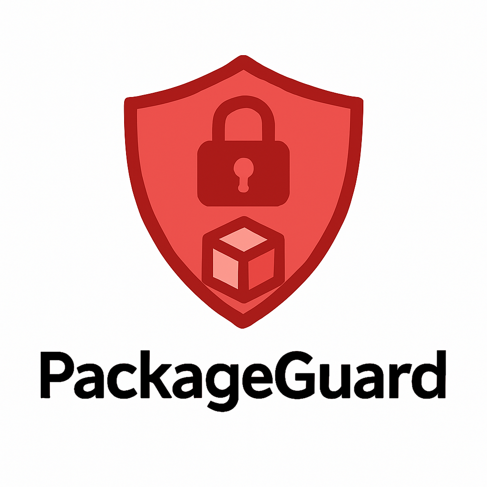

  

<h1 align="center">Get a grip on your open-source packages</h4>

<a href="#about">About</a> •
<a href="#documentation">Documentation</a> •
<a href="#building">Building</a> •
<a href="#contributing">Contributing</a> •
<a href="#versioning">Versioning</a> •
<a href="#credits">Credits</a> •

## Documentation

**Visit the [official documentation website](https://packageguard.org/)** for the full guide to installing, configuring and running PackageGuard.

- [Installation](https://packageguard.org/docs/installation) - install the global tool or the portable deployment
- [Configuration](https://packageguard.org/docs/configuration) - define your allow- and deny-lists
- [Usage](https://packageguard.org/docs/usage) - run a scan and read the results
- [Risk Metrics](https://packageguard.org/docs/risk-metrics) - score packages on legal, security and operational risk
- [Software Bill of Materials](https://packageguard.org/docs/sbom) - emit the dependency graph as CycloneDX or SPDX
- [Caching and Rate Limits](https://packageguard.org/docs/caching-and-rate-limits) - make repeated scans fast and avoid GitHub throttling
- [Roadmap](https://packageguard.org/docs/roadmap) - what's planned next

## About

### What's this?

PackageGuard is a fully open-source CLI tool that keeps your open-source supply chain honest. It scans the **NuGet, npm, pnpm and Yarn** dependencies of your codebase, enforces allow- and deny-lists for licenses, packages and versions, scores every package's legal/security/operational risk, and can emit a standards-compliant SBOM — all from a single, cacheable command that fits into any CI pipeline.

At a glance, PackageGuard can:

- Scan **NuGet, npm, pnpm and Yarn** dependencies across an entire solution or codebase in one run, direct and transitive alike
- Enforce **allow- and deny-lists** for open-source licenses, specific packages, and package versions, discovered **hierarchically** across solution-, project- and repository-level configuration files
- Resolve **licenses** from NuGet/npm metadata, GitHub repositories, and downloaded license text through a chain of fetchers, falling back gracefully when a source doesn't have an answer
- Score every package's **risk** across three dimensions - Legal, Security and Operational - via `--report-risk`, weighing signals such as license compatibility, known vulnerabilities (OSV), maintainer activity, package signing, release cadence, and dozens more
- Back every risk score with **evidence, not just a number**: each package card in the HTML report has a dedicated Evidence section with collapsible, collapsed-by-default panels naming the exact packages, versions, GHSA/OSV vulnerability ids and release dates behind its rationale, so you can see *why* a package scored the way it did without digging through logs
- Produce a **colored console summary**, a **self-contained HTML report** you can open in a browser, and a **SARIF file** for surfacing violations and risk findings directly in GitHub code scanning
- Generate a standards-compliant **Software Bill of Materials (SBOM)** in **CycloneDX** or **SPDX** JSON format via `--sbom`, complete with purls, declared-vs-concluded license evidence, and a direct/transitive dependency graph
- Enrich that SBOM with **vulnerability data** from OSV when `--sbom` is combined with `--report-risk`
- **Cache** package, license and risk data (`--use-caching`) - including GitHub responses and per-repository risk profiles - to keep repeated scans and CI runs fast, with configurable cache freshness (`--risk-cache-max-age-hours`, `--refresh-risk-cache`)
- Run as a **.NET global tool** or a **portable, cross-platform** (Windows/Linux/macOS) deployment - no CI-specific plugin required

### What's so special about that?

I've noticed that the commercial solutions for this are usually very expensive and have functionality that smaller companies may not need. Hopefully this little tools fills the gap between tools like GitHub's Dependabot and expensive commercial products like Blackduck, SNYK  and others.

### Who created this?
My name is Dennis Doomen and I'm a Microsoft MVP and Principal Consultant at [Aviva Solutions](https://avivasolutions.nl/) with 28 years of experience under my belt. As a software architect and/or lead developer, I specialize in designing full-stack enterprise solutions based on .NET as well as providing coaching on all aspects of designing, building, deploying and maintaining software systems. I'm the author of several open-source projects such as [Fluent Assertions](https://www.fluentassertions.com), [Reflectify](https://github.com/dennisdoomen/reflectify), [Liquid Projections](https://www.liquidprojections.net), and I've been maintaining [coding guidelines for C#](https://www.csharpcodingguidelines.com) since 2001.

Contact me through [Email](mailto:dennis.doomen@avivasolutions.nl), [Bluesky](https://bsky.app/profile/dennisdoomen.com), [Twitter/X](https://twitter.com/ddoomen) or [Mastadon](https://mastodon.social/@ddoomen)

## Building

To build this repository locally, you need the following:
* The [.NET SDK](https://dotnet.microsoft.com/en-us/download/visual-studio-sdks) for .NET 9.0 or later (the repository multi-targets `net9.0` and `net10.0`; `global.json` pins local builds to the .NET 10 SDK).
* NPM, PNPM and Yarn available in your PATH
* Visual Studio, [JetBrains Rider](https://www.jetbrains.com/rider/) or [Visual Studio Code](https://code.visualstudio.com/) with the [C# DevKit](https://marketplace.visualstudio.com/items?itemName=ms-dotnettools.csdevkit)

You can also build, run the unit tests and package the code using the following command-line:

`build.ps1`

Or, if you have, the [Fallout tool installed](https://docs.fallout.build/docs/getting-started/installation/):

`fallout`

Also try using `--help` to see all the available options or `--plan` to see what the scripts does.

## Contributing

Your contributions are always welcome! Please have a look at the [contribution guidelines](CONTRIBUTING.md) first.

Previous contributors include:

(Made with [contrib.rocks](https://contrib.rocks))

## Versioning
This library uses [Semantic Versioning](https://semver.org/) to give meaning to the version numbers. For the versions available, see the [tags](/releases) on this repository.

## Credits
This library wouldn't have been possible without the following tools, packages and companies:

* [Spectre.Console](https://spectreconsole.net/) - a .NET library that makes it easier to create beautiful console applications.
* [Fallout](https://fallout.build/) - .NET build automation, the hard-fork successor to [Nuke](https://nuke.build/) by [Matthias Koch](https://github.com/matkoch)
* [CliWrap](https://github.com/Tyrrrz/CliWrap) - Library for running command-line processes by [Oleksii Holub](https://github.com/Tyrrrz)
* [Coverlet](https://github.com/coverlet-coverage/coverlet) - Cross platform code coverage for .NET by [Toni Solarin-Sodara](https://github.com/tonerdo)
* [GitVersion](https://gitversion.net/) - From git log to SemVer in no time
* [ReportGenerator](https://reportgenerator.io/) - Converts coverage reports by [Daniel Palme](https://github.com/danielpalme)
* [StyleCopyAnalyzer](https://github.com/DotNetAnalyzers/StyleCopAnalyzers) - StyleCop rules for .NET
* [Roslynator](https://github.com/dotnet/roslynator) - A set of code analysis tools for C# by [Josef Pihrt](https://github.com/josefpihrt)
* [Serilog](https://serilog.net/) - Flexible, structured events — log file convenience
* [CSharpCodingGuidelines](https://github.com/bkoelman/CSharpGuidelinesAnalyzer) - Roslyn analyzers by [Bart Koelman](https://github.com/bkoelman) to go with the [C# Coding Guidelines](https://csharpcodingguidelines.com/)
* [Meziantou](https://github.com/meziantou/Meziantou.Framework) - Another set of awesome Roslyn analyzers by [Gérald Barré](https://github.com/meziantou)
* [FluentAssertions](https://github.com/fluentassertions/fluentassertions) - Extension methods to fluently assert the outcome of .NET tests
* [Verify](https://github.com/VerifyTests/Verify) - Snapshot testing by [Simon Cropp](https://github.com/SimonCropp)
* [Pathy](https://github.com/dennisdoomen/pathy?tab=readme-ov-file#readme) - Fluently building and using file and directory paths without binary dependencies
* [MemoryPack](https://github.com/Cysharp/MemoryPack) - Zero encoding extreme performance binary serializer for C# and Unity by [Yoshifumi Kawai](https://github.com/neuecc)

## Support the project
* [Sponsor me](https://github.com/sponsors/dennisdoomen)
* [Tip Me](https://paypal.me/fluentassertions)
* [Buy me a Coffee](https://ko-fi.com/dennisdoomen)

## You may also like

* [My Blog](https://www.dennisdoomen.com)
* [Reflectify](https://github.com/dennisdoomen/reflectify) - Reflection extensions without causing dependency pains
* [.NET Library Starter Kit](https://github.com/dennisdoomen/dotnet-package-templates) - A battle-tested starter kit for building open-source and internal NuGet libraries using "dotnet new", born from half a billion downloads
* [C# Coding Guidelines](https://csharpcodingguidelines.com/) - Forkable coding guidelines for all C# versions

## License
This project is licensed under the MIT License - see the [LICENSE](LICENSE) file for details.
